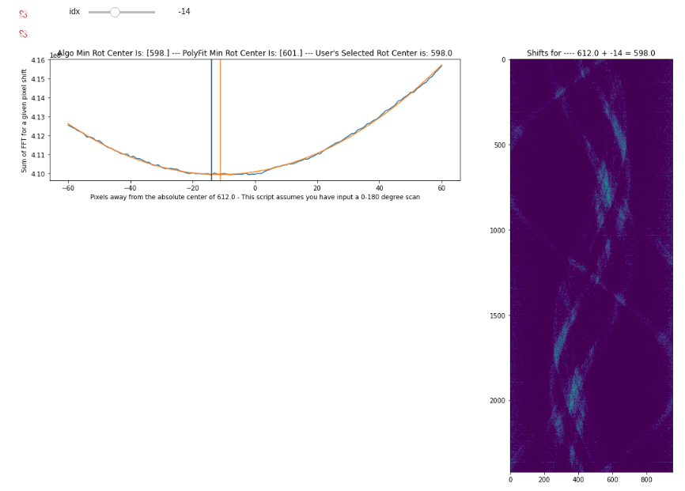

.. _find_rotation_center:

===================================
Finding The Rotation Center
===================================

There are two interactive and one non-interactive method for finding the rotation center of a CT scan through TomoSuitePY.
Below details how one can accomplish these tasks through the provided package.

General Trends of Rotation Center
=================================

When taking a 180 degree scan there should be a correlation betweent the first and the last scan taken.
Appending the inverted and flipped sinogram data to the original sinogram data should produce the full 360 degree sinogram with a small offset where they meet.

Moving the inverted and flipped sinogram left and right,
taking the FFT of each shifted set, and summing the resulting patterns,
allows us to create a loss plot for each rotation center offset.
One can create these plots through the obtain_rotation_center() function through TomoSuitePY.

It is to be noted, that this may take some manual tuning to get correct.

.. warning::

If you are using the PyPi version of TomoSuitePY,
Please view :ref:`installation` and :ref:`starting_project`
before attempting to load in the module. 

.. code:: python

    # Importing the proper functions through tomosuitepy
    from tomosuite.base.rotation_center import obtain_rotation_center

    basedir = '/path/2/project/'
    
    # Trying to find the rotation center
    out = obtain_rotation_center(basedir,
    
            pixel_shift_range=60, # The range of rotation centers to try based upon the absolute center of the image
            number2zero=None, # Number of projections to zero out from the beginning and end
            crop_sinogram=15, # Number of columns to remove of the sinogram - helps remove errors from experimental substrate
            med_filter=False, # Apply a median filter
            min_val=0.18 # Zero out values less than this value - All sinograms are normalized to 1
            
                                )

    
    
Interactive Fine Tune Rotation Center
=====================================

Although this second method for finding the rotation center requires manual identiication of the proper rotation center,
it is more reliable than the method above.

One can choose to set the rot_center_shift_check variable to the amount of rotation centers to check
before and after the absolute center of the 2D projection images.

Then one can either view the reconstructed rotation center images interactivley
through plot_reconstruction_centers(interactive=True), or non-interactivley by setting interactive=False.

.. code:: python

    # Importing the proper functions through tomosuitpy
    from tomosuite.base.reconstruct import reconstruct_data, plot_reconstruction_centers
    basedir = '/path/2/project/'

    # Obtaining the rotation center test slices to be plotted at a later time.
    slcs, user_extra = reconstruct_data(basedir,
                        rot_center=616, # This has no relevence when rot_center_shift_check is enabled
                        start_row=500, # Keep this to a single image for rotation_center_check
                        end_row=501, # Keep this to a single image for rotation_center_check
                        reconstruct_func=tomo_recon, # Allows the user to define their own recon function
                        network=None, #  Keep this to None for rotation_center_check
                        power2pad=False, #  Keep this to False for rotation_center_check
                        edge_transition=None, # Keep this to None for rotation_center_check
                        chunk_recon_size=1, 
                        rot_center_shift_check=40 # Number of rotation centers to try before and after absolute image center
                                       )
     
    # plotting the rotation centers
    # absolute_middle_rotation is printed out when rot_center_shift_check is initalized                                                                  
    plot_reconstruction_centers(slcs, clim=(None, None),
                                absolute_middle_rotation=612, figsize=(20, 20))
    

.. figure:: img/human_tuned_v2.png
    :scale: 50%
    :align: center