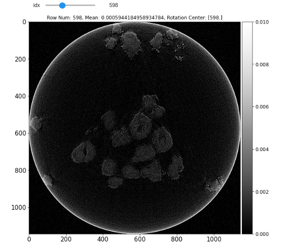

======================================
Using RIFE Network to DeSparse - Full
======================================

RIFE Conda Environment Installation - Command Line
===================================================

Use the following code inside your terminal to install the required packages to be used for RIFE network.

.. code:: python

    # Installing RIFE packages
    conda create -n rife_tomosuite --file /location/to/tomosuitpy/github/clone/envs/rife.yml
    
    source activate rife_tomosuite
    
    ipython kernel install --user --name=rife_tomosuite

Basic Conda Environment Installation - Command Line
====================================================

Basics of tomosuitepy (excluding RIFE, Noise2Noise, TomoGAN, and Deepfill networks) - Used for GridRec/SIRT Reconstructions as well as projection extraction.

.. code:: python

    # Installing basic packages
    conda create -n test_basic python=3.6
    conda env update -n test_basic --file /location/to/tomosuitpy/github/clone/envs/basic.yml
    
    source activate test_basic
    
    ipython kernel install --user --name=test_basic

Starting A Project - Jupyter
============================

In order to begin using TomoSuitePY, one must create a project for their .h5 data. Sometimes it is necessary to create multiple projects for a single task, but this is only when one is to use a sacraficial sample for network training. All use cases of a second project are detailed in the documentation of TomoSuite

It is also imperative that the User has the test_basic conda enviroment installed for this part of the tutorial. 

Importing TomoSuitePY
---------------------

.. code:: python

    import sys
    sys.path.append('/path/to/tomosuitepy/github/clone/tomosuitepy/')

    from tomosuitepy.base.start_project import start_project
    from tomosuitepy.base.extract_projections import extract

Starting A Project
------------------

.. code:: python

    # The directory path where the raw experimental file lives
    datadir = '/local/data/experimental/'
    
    # The file name of the data the User would like to import
    fname = 'Experiment_01.h5'
    
    # The folder path where the User would like to store project data to
    basedir = '/local/data/project_01/'
    

    start_project(basedir=basedir)

    extract(datadir=datadir,
                fname=fname,
                basedir=basedir,
                chunking_size=10) # Set chunk_size4downsample to 1 if you have a lot of RAM

DeSparse Angle With Rife Neural Network
========================================

If any User would like to improve sparse angle tomographic scans, please use the following protocols.

Please now initiate the rife_tomosuite network for this part of the tutorial

Loading In TomoSuitePY - Jupyter
--------------------------------

.. code:: python

    import sys
    sys.path.append('/location/of/tomosuitepy/github_repo/')

Placing Projections Into .MP4 - Jupyter
---------------------------------------

.. code:: python

    from tomosuitepy.easy_networks.rife.data_prep import create_prj_mp4, rife_predict, obtain_frames

    output = create_prj_mp4(basedir, # Project file - definition in Start Project docs
                            sparse_angle_removal=1, # Use ever x frame
                            fps=10, # fps of output movie - 10fps is standard
                            apply_exp=False # If the User would like to apply a log to the frames
                            )
    

Obtain Network Prediction Command - Jupyter + Command Line
-----------------------------------------------------------
    
.. code:: python   

    # Take the output of this command and run it through your terminal with the rife conda environment activated
    rife_predict(basedir, exp=2, gpu='0')
    
 
Read The Network Prediction And Save New Projections - Jupyter
---------------------------------------------------------------

.. code:: python   

    frames = obtain_frames(basedir, video_type='predicted', output_folder='frames')
    

Interactive Fine Tune Rotation Center - Jupyter
===============================================

For this section please make sure that the base conda environment is activated

.. code:: python

    import tomopy
    from tomosuitepy.base.reconstruct import reconstruct_data, plot_reconstruction, plot_reconstruction_centers
    
    basedir = '/local/data/path/'
    
    
    def tomo_recon(prj, theta, rot_center, user_extra=None):

        recon = tomopy.recon(prj, theta,
                            center=rot_center,
                            algorithm='gridrec',
                            ncore=8)
        return recon, user_extra

    slcs, user_extra = reconstruct_data(basedir,
                        rot_center=616, # This has no relevence when rot_center_shift_check is enabled
                        start_row=500, # Keep this to a single image for rotation_center_check
                        end_row=501, # Keep this to a single image for rotation_center_check
                        reconstruct_func=tomo_recon, # Allows the user to define their own recon function
                        network=None, #  Keep this to None for rotation_center_check
                        power2pad=False, #  Keep this to False for rotation_center_check
                        edge_transition=None, # Keep this to None for rotation_center_check
                        chunk_recon_size=1, 
                        rot_center_shift_check=40 # Number of rotation centers to try before and after absolute image center
                                       )
     # absolute_middle_rotation is printed out when rot_center_shift_check is initalized                                 
                                       
    plot_reconstruction_centers(slcs[0:], clim=(0, 0.01), absolute_middle_rotation=612, figsize=(20, 20))
    

    
 
Use TomoSuite To Reconstruct New Frames - Jupyter
=================================================

Use the "base" conda environment for this step. Tomopy/Astra do not play well with the RIFE network requirements. View installation documentation for this step.

.. code:: python   
     

    frames_folder = 'frames'
    output_image_type = '.tif'
    apply_log = False

    slcs_v1, user_extra = reconstruct_data(basedir,
                                            rot_center=598, 
                                            reconstruct_func=tomo_recon,
                                            network='rife',
                                            start_row=None,
                                            end_row=None,
                                            power2pad=True,
                                            rife_types=[frames_folder, output_image_type, apply_log])

    fig = plot_reconstruction(slcs_v1, clim=(None, None), cmap='rainbow')
