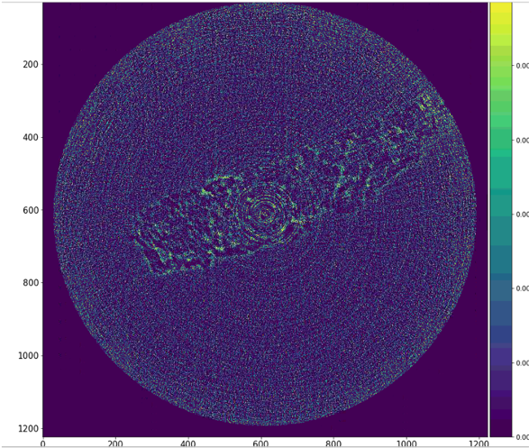
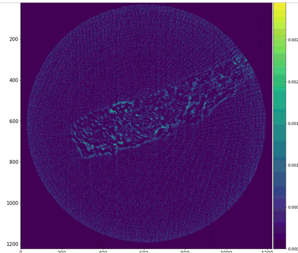
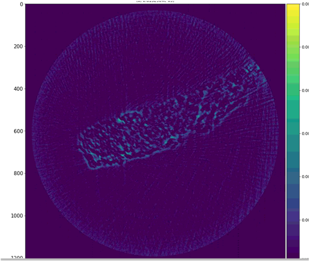
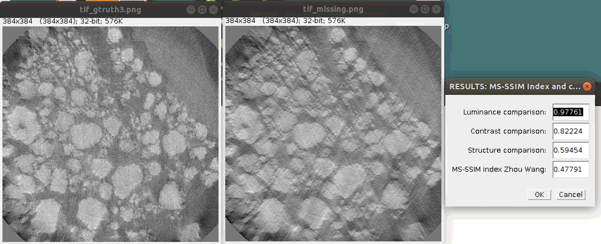
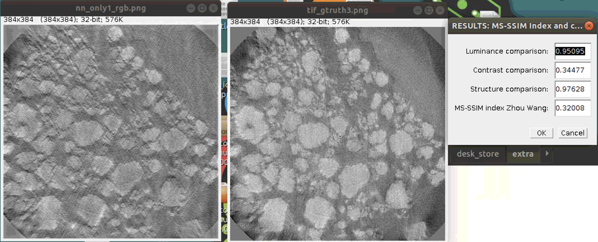
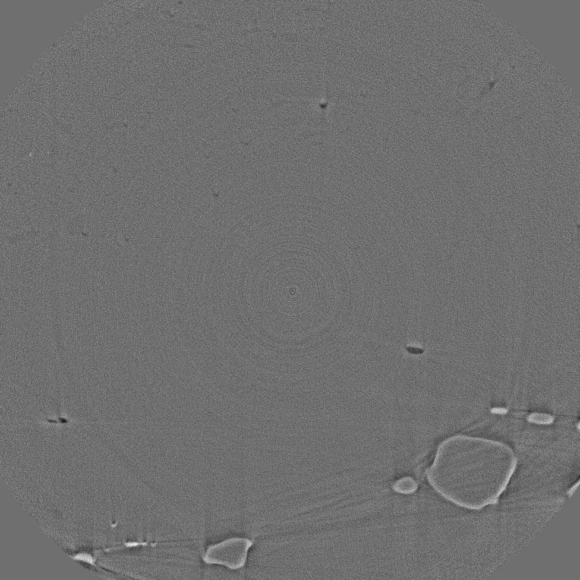
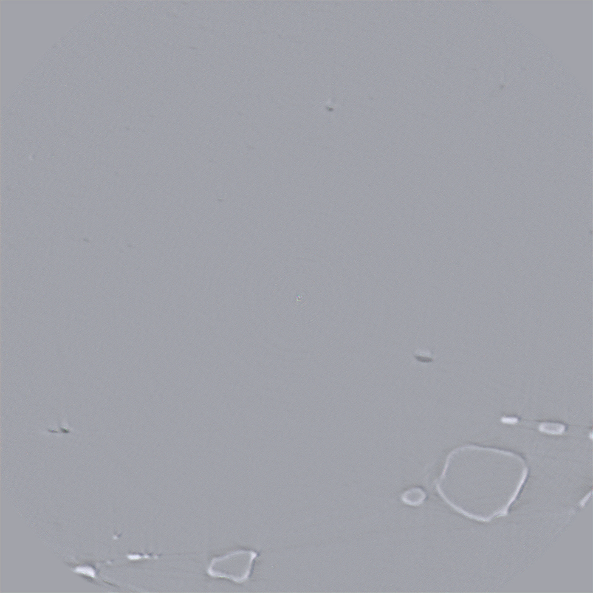

=================
What is TomoSuite
=================
TomoSuite is a culmination of machine learning networks and data preparation methods for those networks for the enhancement of poor-quality tomographic datasets. Novel implementations of existing architectures are available for Users to de-noise, de-wedge artifact, de-sparse angle artifact, and de-ring artifact their own datasets without the need for obtaining any true ground truth datasets. The goal of this project is not only to bring these networks into the tomographic world, but to make them as User friendly as possible, expanding the usability to novices in the machine learning domain. 

.. note::

    - Type 1 Training: train a neural network with 1 experimental dataset and apply the trained network only to that same experimental dataset.
    |
    - Type 2 Training: train a neural network with 1 experimental dataset and apply the trained network to other datasets.

**DeNoise Tomographic Reconstructions:**

- DeNoise Projections by :ref:`denoise_type1` Training (TomoGAN)

- DeNoise Projections by :ref:`denoise_type2` Training (TomoGAN)
        
**DeWedge Tomographic Reconstructions:**

- DeWedge Reconstructions by :ref:`dewedge_type11` Training (DeepFillv2 + Noise2Noise)

- DeWedge Reconstructions by :ref:`dewedge_type12` Training (Noise2Noise)

- DeWedge Reconstructions by :ref:`dewedge_type2` Training (TomoGaN)

**DeSparse Angle:**

- DeSparse Angle by :ref:`desparse_type11` Training (Noise2Noise)

- DeSparse Angle by :ref:`desparse_type12` Training (DAIN)

- DeSparse Angle by :ref:`desparse_type2` Training (TomoGAn)

**DeRing + DeSparse Angle Artifact:**

- DeMulti-artifact by :ref:`dering_type1` Training (Noise2Noise)

DeNoise Protocols
=================

.. _denoise_type1:

Type 1
------

|
|

This is reconstruction (GridRec) of Raw Experimental data (left) and Denoised Experimental data (right) by Fake Noise machine learning.
    
|
|

.. _denoise_type2:

Type 2
------

Caption: This is reconstruction (GridRec) of Raw Experimental data (left) and Denoised Experimental data (right) by Sacraficial Sample machine learning.

DeWedge Protocols
=================

.. _dewedge_type11:

Type 1 (V1)
-----------

.. _dewedge_type12:

Type 1 (V2)
-----------

.. figure:: img/dewedge_type1_v2_og.png
    :scale: 50%
    :align: left

.. figure:: img/dewedge_type1_v2.png
    :scale: 50%
    :align: right

.. _dewedge_type2:

Type 2
------

DeSparse Angle Protocols
========================

.. _desparse_type11:

Type 1 (V1)
-----------

.. _desparse_type12:

Type 1 (V2)
-----------

.. _desparse_type2:

Type 2
------

DeRing + DeSparse Angle Protocol
================================

.. _dering_type1:

Type 1 (V1)
-----------

