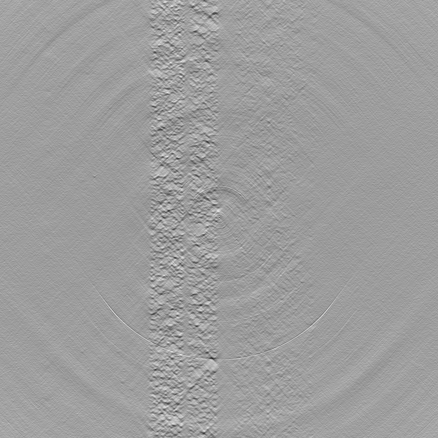
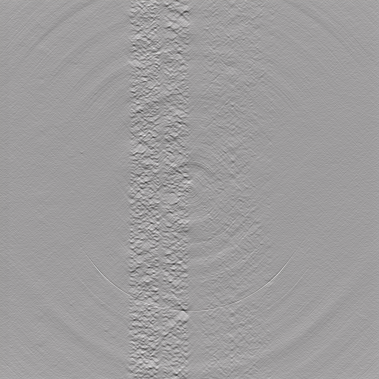

=================
What is TomoSuite
=================
TomoSuite is a python module which allows Users to train their own neural networks to imporove Tomographic reconstructions. The core functionalities include:

.. note::

    - Type 1 Training: train a neural network with 1 experimental dataset and apply the trained network only to that same experimental dataset.
    
    - Type 2 Training: train a neural network with 1 experimental dataset and apply the trained network to other datasets

DeNoise Tomographic Reconstructions:

- DeNoise Projections by :ref:`denoise_type1` Training (TomoGAN)

- DeNoise Projections by :ref:`denoise_type2` Training (TomoGAN)
        
DeWedge Tomographic Reconstructions:

- DeWedge Reconstructions by :ref:`dewedge_type11` Training (DeepFillv2 + Noise2Noise)

- DeWedge Reconstructions by :ref:`dewedge_type12` Training (Noise2Noise)

- DeWedge Reconstructions by :ref:`dewedge_type2` Training (TomoGaN)

DeSparse Angle

- DeSparse Angle by :ref:`desparse_type11` Training (Noise2Noise)

- DeSparse Angle by :ref:`desparse_type12` Training (DAIN)

- DeSparse Angle by :ref:`desparse_type2` Training (TomoGAn)

DeRing + DeSparse Angle Artifact

- DeMulti-artifact by :ref:`dering_type1` Training (Noise2Noise)

DeNoise Protocols
=================

.. _denoise_type1:

Type 1
------

Caption: This is reconstruction (GridRec) of Raw Experimental data (left) and Denoised Experimental data (right) by Fake Noise machine learning.
    
    
.. _denoise_type2:

Type 2
------

Caption: This is reconstruction (GridRec) of Raw Experimental data (left) and Denoised Experimental data (right) by Sacraficial Sample machine learning.

DeWedge Protocols
=================

.. _dewedge_type11:

Type 1 (V1)
-----------

.. _dewedge_type12:

Type 1 (V2)
-----------

.. _dewedge_type2:

Type 2
------

DeSparse Angle Protocols
========================

.. _desparse_type11:

Type 1 (V1)
-----------

.. _desparse_type12:

Type 1 (V2)
-----------

.. _desparse_type2:

Type 2
------

DeRing + DeSparse Angle Protocol
================================

.. _dering_type1:

Type 1 (V1)
-----------

